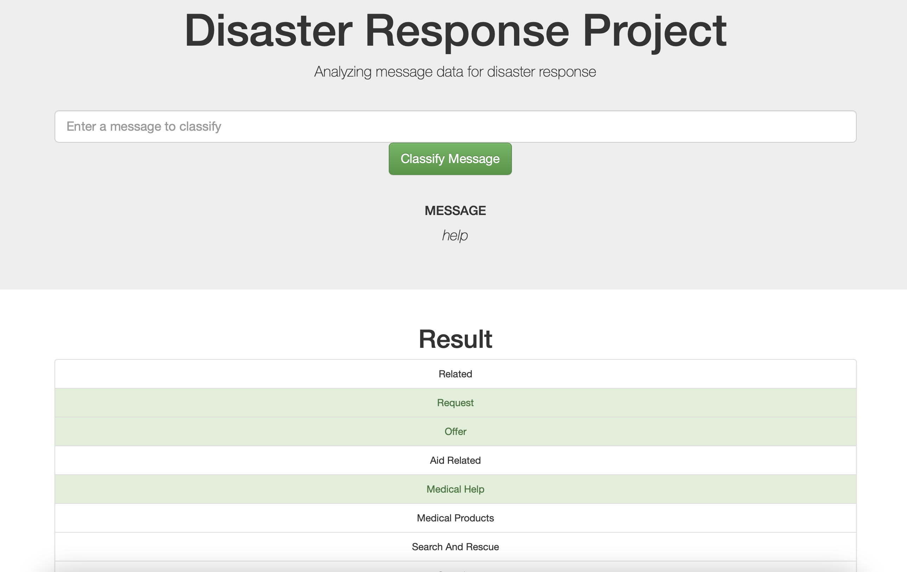

# Disaster Response Pipeline Project

## Table of contents

- [Project Motivation](#project-motivation)
- [Libraries](#libraries)
- [Files included](#files-included)
- [Running Instructions](#instructions)
- [Example Output](#example-output)
- [acknowledgements](#acknowledgements)

## Project Motivation

Disaster Response is a vital part of giving aid to those in need, and thanks to Figure-Eight, we are able to 
see how we would classify messages in these cases. Natural language processing(NLP) and machine learning models
help us to paint a good picture of how to respond. The following steps are used: 

- ETL: extract raw data and parse using NLP to get meaningful classification categories
- Build a machine learning model based on the extracted text data. 
- Create a web app with trained model and parsed data. 

## Libraries

The following libraries are used in this analysis:
- numpy
- pandas
- sklearn
- sqlite3
- sqlalchemy
- re
- nltk
- pickle

## Files Included

Jupyter Notebooks:
- ETL Pipeline Preparation.ipynb: jupyter notebook with ETL processes and NLP text analysis
- ML Pipeline Preparation.ipynb: jupyter notebook taking parsed data and training model pipelines; this one trains a random forest and k nearest neighbors

Python Files:
- process_data.py: this includes all of the ETL pipeline in a python file so that it can be quickly run
- train_classifier.py: this includes all of the ML Pipeline preparation in a python file so that it can be quickly run
= run.py: This combines all of the data transformations and models into a web app as well as creating data visualizations

Data files:
- disaster_categories.csv: list of all the categories that disasters can be categorized as
- disaster_messages.csv: Disaster messages that need to be classified

## Running Instructions:
1. Run the following commands in the project's root directory to set up your database and model.

    - To run ETL pipeline that cleans data and stores in database
        `python data/process_data.py data/disaster_messages.csv data/disaster_categories.csv data/DisasterResponse.db`
    - To run ML pipeline that trains classifier and saves
        `python models/train_classifier.py data/DisasterResponse.db models/classifier.pkl`

2. Run the following command in the app's directory to run your web app.
    `python run.py`

3. Go to http://0.0.0.0:3001/

## Example Output
- This is what it will look like if you classify a message. In this case, it fit three categories.

- Here is a plot with the genre distributions. 

- Finally, this is a plot of the category distributions. 

## Acknowledgements

Thanks to Figure Eight and Udacity for the data  in this analysis!
